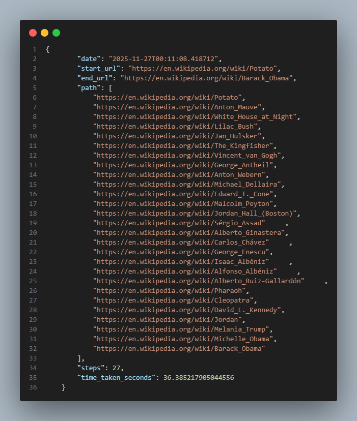
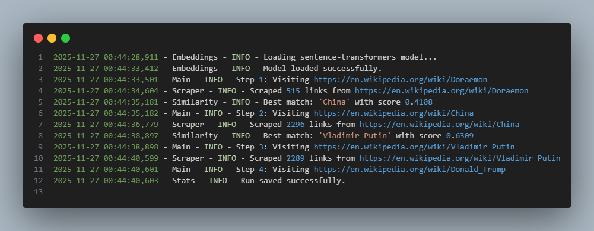

# 🏎️ Wikipedia Speedrunner (Python Edition)

> *Because clicking links manually is so 2010.*

Welcome to the **Wikipedia Speedrunner**! This isn't your average "click random links until you find Jesus" bot. This is a **smart**, AI-powered racer that uses vector embeddings to *understand* the meaning of words and navigate Wikipedia like a pro.

---

## 📸 See It In Action




*(Place your screenshot here! Show off that terminal glory.)*

---

## 🧠 How It Works (The Magic)

Most bots just look for keywords. We do it differently:

1.  **Scrape**: We grab all the links from the current Wikipedia page.
2.  **Embed**: We use `sentence-transformers` to turn every link text into a **vector** (a list of numbers representing meaning).
3.  **Compare**: We calculate the **Cosine Similarity** between those link vectors and your **Target Goal** vector.
4.  **Race**: We pick the link with the highest score and jump to it!

It's like playing "Hot or Cold" but with high-dimensional mathematics. 🤓

---

## 📊 Visualizing the Data

The bot saves every run to `data/speed_runs.json`. Here is what a run looks like:

### Example: The "SpongeBob" Run 🧽 ➡️ 🐟

We asked the bot to go from **SpongeBob SquarePants** to **Marine biology**.

```json
{
    "start_url": "https://en.wikipedia.org/wiki/SpongeBob_SquarePants",
    "end_url": "https://en.wikipedia.org/wiki/Marine_biology",
    "path": [
        "https://en.wikipedia.org/wiki/SpongeBob_SquarePants",
        "https://en.wikipedia.org/wiki/Marine_biology"
    ],
    "steps": 2,
    "time_taken_seconds": 1.55
}
```
*It found the direct link immediately!*

### Example: The "Potato" Odyssey 🥔 ➡️ 🇺🇸

We asked it to go from **Potato** to **Barack Obama**. It took a scenic route through art, music, and history:

> Potato -> Anton Mauve -> White House at Night -> ... -> Michelle Obama -> Barack Obama

*(It turns out potatoes are surprisingly well-connected to the White House via Dutch painters!)*

---

## 📝 Log Snapshots

Want to see what the bot is thinking? Check the `logs/` folder.




---

## 🚀 Getting Started

### 1. Clone & Install
```bash
git clone https://github.com/Deepender25/Wiki-Racer.git
cd Wiki-Racer
python -m venv venv
# Windows
.\venv\Scripts\activate
# Mac/Linux
# source venv/bin/activate

pip install -r requirements.txt
```

### 2. Run the Racer
```bash
python main.py
```

### 3. Enter Your Challenge
```text
Enter Start Wikipedia URL (or term): Batman
Enter End Wikipedia URL (or term): Superman
```

---

## 📂 Project Structure

*   `src/scraper.py`: The web crawler (handles the HTML).
*   `src/embeddings.py`: The brain (loads the AI model).
*   `src/similarity.py`: The math (calculates vectors).
*   `src/stats.py`: The historian (saves your runs).
*   `logs/`: Where the bot writes its diary.
*   `data/`: Where your speedrun records live.

---

## 🤝 Contributing

Got a better pathfinding algorithm? Found a bug?
1.  Fork it.
2.  Branch it (`git checkout -b feature/cool-thing`).
3.  Commit it.
4.  Push it.
5.  Pull Request it.

---

*Made with 🐍, 🤖, and a lot of Wikipedia reading.*
