# 🏎️ Wiki-Racer (Python Edition)

> *Because clicking links manually is so 2010.*

Welcome to **Wiki-Racer**! This is an AI-powered speedrunner that navigates Wikipedia not by random chance, but by *understanding* the meaning of words. It uses vector embeddings to find the semantic "scent" of your target page and chases it down like a bloodhound with a PhD. 🎓🐕

---

## 📸 See It In Action


*(Yes, it actually works. We have the screenshots to prove it.)*

---

## 🧠 Key Features

Wiki-Racer is engineered for speed, accuracy, and making you feel like a wizard.

*   **🧠 Deep Semantic Pathfinding**: The secret sauce. Instead of just matching keywords, we use `sentence-transformers` to understand that "King" is close to "Queen" but far from "Potato". (Unless it's a Potato King. We don't judge.)
*   **🎯 High-Precision Similarity**: We use optimized **NumPy vectorization** (dot products) to rank thousands of links in milliseconds. It’s math, but faster.
*   **🦀 Robust Scraper**: Our custom scraper (`scraper.py`) handles Wikipedia's HTML quirks and politely identifies itself to avoid the ban hammer.
*   **⏱️ Automatic Logging**: Every run is saved to a date-stamped log file. Perfect for debugging or reliving your greatest speedrun glories.
*   **📈 Stats & Analytics**: We track your runs in `data/speed_runs.json` so you can calculate average times and prove to your friends that your bot is faster than theirs.

---

## ⚙️ Architecture & Workflow

How does it actually work? Here is the flow of a single run:

```mermaid
graph TD
    A[Start] --> B{Initialize Models}
    B --> C[User Inputs URLs]
    C --> D(Current Page)
    D --> E{Is Target?}
    E -- Yes --> F[🎉 VICTORY!]
    E -- No --> G[Scrape Links]
    G --> H[Generate Embeddings]
    H --> I[Calculate Cosine Similarity]
    I --> J[Select Best Link]
    J --> D
```



The system is built entirely in Python, utilizing:
*   **Scraping**: `beautifulsoup4` & `requests`
*   **Intelligence**: `sentence-transformers`
*   **Math**: `numpy` (for that sweet, sweet vectorization)

---

## 📂 Project Structure

We keep things tidy around here.

```text
wikipedia_run_python_manual/
├── 📄 demo_run.png              # Proof that it works
├── 📄 log_snippet.png           # What the matrix looks like
├── 📄 requirements.txt          # The "ingredients" list
├── 📄 README.md                 # You are here
├── 📄 main.py                   # The big red button (Entry Point)
└── 📂 src/                      # The Brains
    ├── 📄 scraper.py            # The Grabber (Fetches links)
    ├── � embeddings.py         # The Thinker (Loads AI models)
    ├── 📄 similarity.py         # The Judge (Compares vectors)
    ├── 📄 stats.py              # The Accountant (Saves records)
    └── 📄 logger_config.py      # The Scribe (Writes logs)
```

---

## 🚀 Getting Started

### Prerequisites
*   **Python 3.x** (The snake language)
*   **pip** (The package installer)

### Installation

1.  **Clone the Repo**
    ```bash
    git clone https://github.com/Deepender25/Wiki-Racer.git
    cd Wiki-Racer
    ```

2.  **Set up the Environment**
    ```bash
    python -m venv venv
    # Windows
    .\venv\Scripts\activate
    # Mac/Linux
    # source venv/bin/activate
    ```

3.  **Install Dependencies**
    ```bash
    pip install -r requirements.txt
    ```

---

## 🔧 Usage

To start a race, just run the main script. It's interactive, so it will ask you where to start and where to go.

```bash
python main.py
```

**Example Session:**
```text
Welcome to Wikipedia Speedrunner (Python Edition)!
--------------------------------------------------
Enter Start Wikipedia URL (or term): Batman
Enter End Wikipedia URL (or term): Superman

Goal: https://en.wikipedia.org/wiki/Batman -> https://en.wikipedia.org/wiki/Superman
Initializing models... (Hold on tight)
...
[Step 1] Visiting Batman...
Best link: Justice League
...
>>> TARGET REACHED! <<<
```

### 📝 Logs & Stats
Check the `logs/` folder to see exactly what the bot was "thinking" at each step.
Check `data/speed_runs.json` to see your high scores.

---

## 🤝 Contributing

Got a better pathfinding algorithm? Found a bug?
1.  Fork it.
2.  Branch it.
3.  Commit it.
4.  Push it.
5.  **Pull Request it.**

---

*Made with 🐍, 🤖, and a healthy obsession with graph theory.*
